# Artifacts — UX user stories, mockups & context

*Fleshing out the [push-to-a-shared-web-interface user story](../README.md): how one lab's result reaches
the people who need it on a **shared web surface**, readable with no discourse-graph tooling — from a
**collaborator's dashboard** (the central case) to the **fully public** web. Built from
[`../AGENTS.md`](../AGENTS.md) (the spec), the **Vogel × Kate** lab-collaboration sessions, the
**Quantum Sensing Institute** pilot, and the [MIRA schema](https://github.com/MIRA-science/schema).*

> **Start here.** To **build or maintain the mockups**, read the single current spec
> **[`ux-spec.md`](./ux-spec.md)** — it folds the user stories, the design brief, and the dated
> `ux-spec-update-*` deltas into one document and matches the screens as built. To **see** the work, open
> the **[live mockup gallery ↗](https://mira-science.github.io/inter-lab-user-story/)** (hosted on GitHub
> Pages — GitHub shows the `.html` files as raw source). PNG previews are inlined below so the work is
> viewable on GitHub without opening anything.

---

## What's in here

| Artifact | What it is |
|---|---|
| **[`ux-spec.md`](./ux-spec.md)** ★ **canonical** | **The single current UX spec — build from this.** Folds the narratives, the brief, and the four dated `ux-spec-update-*` deltas + the glance-trust correction into one current document (screens · components · design system · acceptance · changelog), matching the mockups as built. |
| **[`dev-handoff-dashboard.md`](./dev-handoff-dashboard.md)** | **Developer handoff for screens 06–11** — exact measurements, tokens, component contracts, states, breakpoints, animations, accessibility, and a spec-vs-built **consistency report**. Generated from `ux-spec.md`, verified against the mockups. |
| **[`ux-user-story-dashboard.md`](./ux-user-story-dashboard.md)** | *(folded into `ux-spec.md`)* **The central narrative** — Sean → Kate's dashboard: the cast, the **two currents** (results out, requests back), the **five moments** (share → glance-and-trust → traverse → request → consortium), journey maps, the mockup-map, acceptance, open questions. |
| **[`_grounding-dashboard.md`](./_grounding-dashboard.md)** ★ | **The central context pack** — user story / user constraints / tech constraints, with verified quotes from the three Granola sessions and the user-story canvas. |
| **[`ux-user-story.md`](./ux-user-story.md)** | The retained **public-extreme** narrative — QSI → the world: the four moments (publish → read-cold → cite → compile). |
| **[`_grounding.md`](./_grounding.md)** | The retained **public-extreme** context pack (QSI). |
| **[`_design-brief.md`](./_design-brief.md)** | The visual brief both mockup sets were built against — the shared design system, both worked examples, the per-screen specs. *(predates v0.4; folded into `ux-spec.md`)* |
| `ux-spec-update-*.md` · `ux-research-synthesis-*.md` | **The dated decision record** (v0.1 → v0.4 + the glance-trust correction) — how each change was reached. Folded into `ux-spec.md`; kept for provenance. |
| **[`mockups/`](./mockups/)** | **Eleven** interactive HTML screens + a gallery `index.html` — **[view live ↗](https://mira-science.github.io/inter-lab-user-story/)** — sharing one design system (`tokens.css` + `components.css`). **06–11** the dashboard (central); **01–05** the public extreme. |
| **[`mockups/previews/`](./mockups/previews/)** | PNG renders of every screen (shown below) for quick/GitHub viewing. |

---

## The spine — one shared web surface, two worked examples

Both stories push a result to a **shared web interface** readable without a DG app. They differ in **how
open** the surface is and **whether a `Request` flows back**:

- **Central — the Sean → Kate dashboard.** Sean (Vogel Lab) pushes a *selected subgraph* to a
  **read-only shared dashboard** — **public or password-protected (consortium)** — that Kate's lab
  navigates in a browser. **Two currents:** results out, and a **`Request`** back.
- **The public extreme — QSI → the world.** The same machinery taken fully public: no relationship, no
  shared tooling, strangers only. **One direction.**

### The dashboard moments (central)
1. **Share a selected subgraph** — Sean picks the `Evidence` bundle, sets per-node visibility (raw stacks
   gated, working notes withheld), chooses public vs. consortium, and pushes via KOI. → mockup **06**
2. **Glance and trust** — Kate opens the dashboard in a browser, picks a view/preset, reads the summary
   and the provenance, and trusts it. → mockup **07**
3. **Traverse to the method** — a grad student follows the lineage to the **segmentation threshold**,
   opens the pointers and the walkthrough, hits the gated raw data. → mockup **08**
4. **Request back** — they send a **`Request`** for a follow-up experiment/analysis; Sean is notified. → mockup **08**
5. **Run it as a consortium** — many collaborators, audience presets, public-vs-gated, orphaned results
   made discoverable. → mockup **09**

### The QSI moments (public extreme)
**Publish to the public** (→ 01) · **read it cold at a URL** (→ 02, 03) · **cite it, frozen** (→ 05) ·
**compile bundles into a narrative** (→ 04).

---

## Mockups — the Sean → Kate dashboard (central)

The worked example: the Vogel × Kate **cluster composition-over-time** result (illustrative,
unpublished): *clusters change composition over time — the Pearson correlation of two cluster
components climbs from negative to positive over ~10–15 min*, grounded in a live high-resolution imaging
`Study`, following a preparation → perturbation → imaging → **segmentation** `Protocol`, carrying **pointers** (git /
curated CSV / gated 80 GB raw stacks / video), never the raw images. *(Components redacted to Component 1 /
Component 2.)*

### Gallery — [`mockups/index.html`](./mockups/index.html) · [**open live ↗**](https://mira-science.github.io/inter-lab-user-story/)
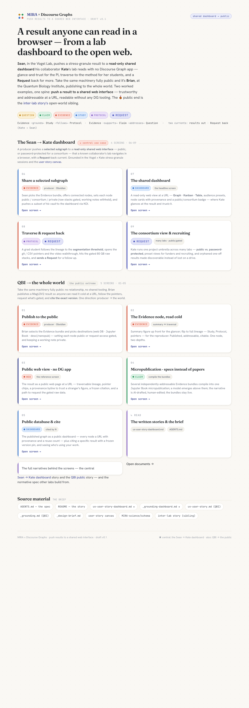

### 06 · Share a selected subgraph — [`mockups/06-share-to-dashboard.html`](./mockups/06-share-to-dashboard.html) · [**open live ↗**](https://mira-science.github.io/inter-lab-user-story/06-share-to-dashboard.html)
*Producer side, in Obsidian. Sean picks the `Evidence` bundle, **offers connected nodes**, sets each node
**public / consortium / private** (raw stacks **request-access-gated**, a working note **withheld without
leaking**), chooses **public vs. password-protected**, lets a **candidate** node ride along, and **pushes
via KOI** (shared = visible, not editable) (R1, R2, R4, R5, R12).*
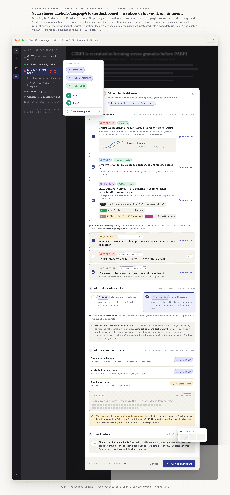

### 07 · The shared dashboard — [`mockups/07-shared-dashboard.html`](./mockups/07-shared-dashboard.html) · [**open live ↗**](https://mira-science.github.io/inter-lab-user-story/07-shared-dashboard.html)
*The headline screen. A **read-only** web view at a URL — **Graph · Kanban** views, **audience
presets** (Results / Experiments-in-progress / Questions & requests), node cards with provenance and a
**public/consortium** badge — where Kate **glances at the result and trusts it**. Colorblind-safe,
legible (R6, R8).*
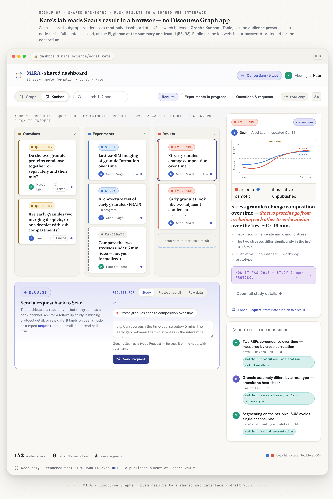

### 08 · Traverse & request back — [`mockups/08-traverse-and-request.html`](./mockups/08-traverse-and-request.html) · [**open live ↗**](https://mira-science.github.io/inter-lab-user-story/08-traverse-and-request.html)
*A grad student traverses `Evidence ←grounds← Study →follows→ Protocol` to the **segmentation choice**
(segment on the per-pixel SUM of both channels), follows the `git`/`data` **pointer chips** and the
**video walkthrough**, hits **request-access** on the 80 GB raw stacks, and **sends a `Request`** back for
a follow-up — the reverse current (R2, R4, R5, R7, R13).*
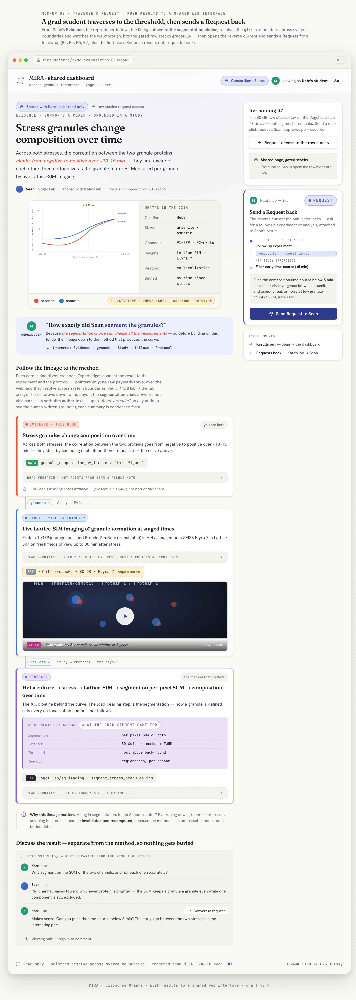

### 09 · The consortium view & recruiting — [`mockups/09-consortium-view.html`](./mockups/09-consortium-view.html) · [**open live ↗**](https://mira-science.github.io/inter-lab-user-story/09-consortium-view.html)
*Kate as consortium lead: one project umbrella across **many labs**, **public vs. password-protected**,
**preset views per audience** (a funder seeing experiments-in-progress; the public seeing open
questions/requests for **recruiting**), and unpublished one-off results made **discoverable** instead of
lost on a drive (R5, R6, R8).*
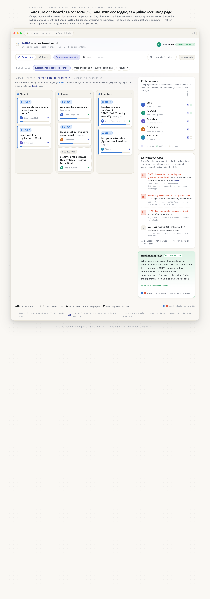

### 10 · The evidence card — embedded method — [`mockups/10-evidence-card.html`](./mockups/10-evidence-card.html) · [**open live ↗**](https://mira-science.github.io/inter-lab-user-story/10-evidence-card.html)
*The headline component in isolation: one **result-first** Evidence card with the method **folded in**,
shown at all four states — collapsed (PI glance), method open at the **segmentation choice** (reproducer),
a **candidate** awaiting "Convert to evidence", and a comment **thread that converts to a `Request`**.
Glance-and-trust is passive — there is no Endorse (R2, R4, R8).*
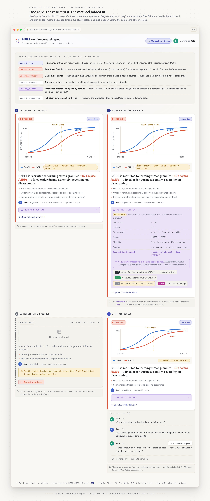

### 11 · Meeting prep — since last sync — [`mockups/11-meeting-prep.html`](./mockups/11-meeting-prep.html) · [**open live ↗**](https://mira-science.github.io/inter-lab-user-story/11-meeting-prep.html)
*Mobile-first. A **"since last sync" diff** the student opens to prepare — what's **on the agenda** for the
next meeting, what **changed**, and (folded) what **hasn't** — with self-set deadlines and an opt-in
**Follow** for the PI. The calm replacement for a nudge: staleness is folded, never pushed (R4, R5, R6).*
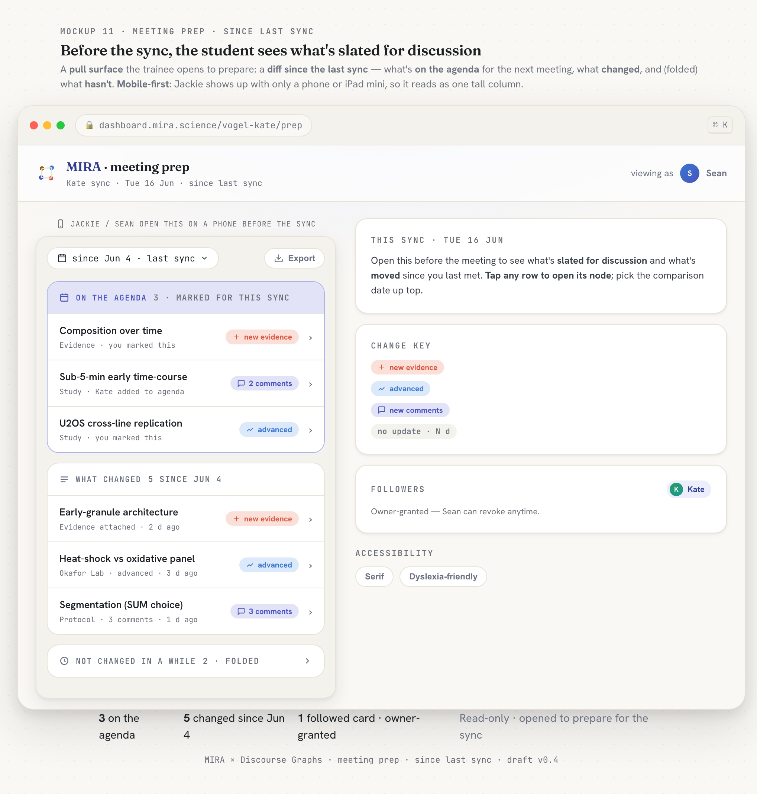

---

## Mockups — QSI → the whole world (the public extreme)

The worked example: the QSI **MFX-2 magnetic-field effect** (illustrative, unpublished): *the sign of
the mean magnetic-field effect flipped from positive to negative as field strength increased at low
fields* — a fieldscope live-imaging `Study`, a MFX-2-loading + applied-field `Protocol`, carrying
pointers, never the raw image stacks.

### 01 · Publish to the public — [`mockups/01-publish.html`](./mockups/01-publish.html) · [**open live ↗**](https://mira-science.github.io/inter-lab-user-story/01-publish.html)
*Producer side, in Obsidian. Brian picks the destinations (DG web DB · Jupyter Book · desci/nanopub),
sets the raw data **request-access-gated**, and keeps a working note private **without leaking it**.*
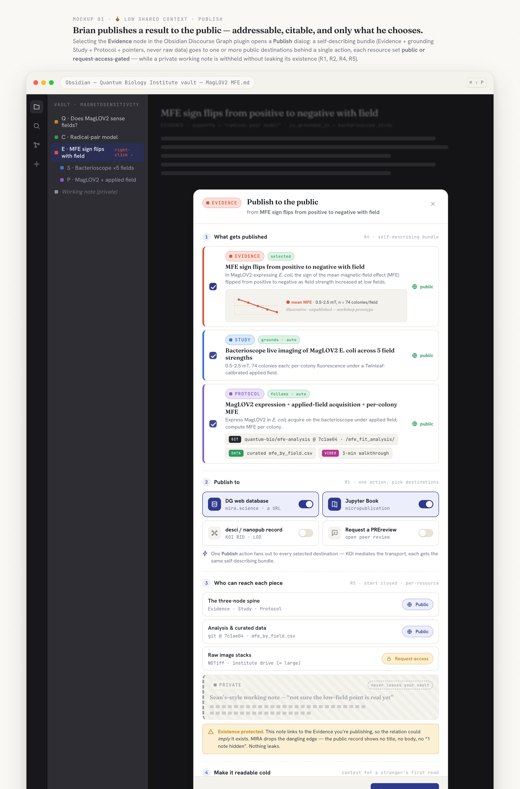

### 02 · The Evidence node, read cold — [`mockups/02-evidence-node.html`](./mockups/02-evidence-node.html) · [**open live ↗**](https://mira-science.github.io/inter-lab-user-story/02-evidence-node.html)
*Summary up front for the glancer — figure + "what's in the sample" methods table — then flip to **full
lineage**. One node, two depths (R2, R3, R4, R8).*
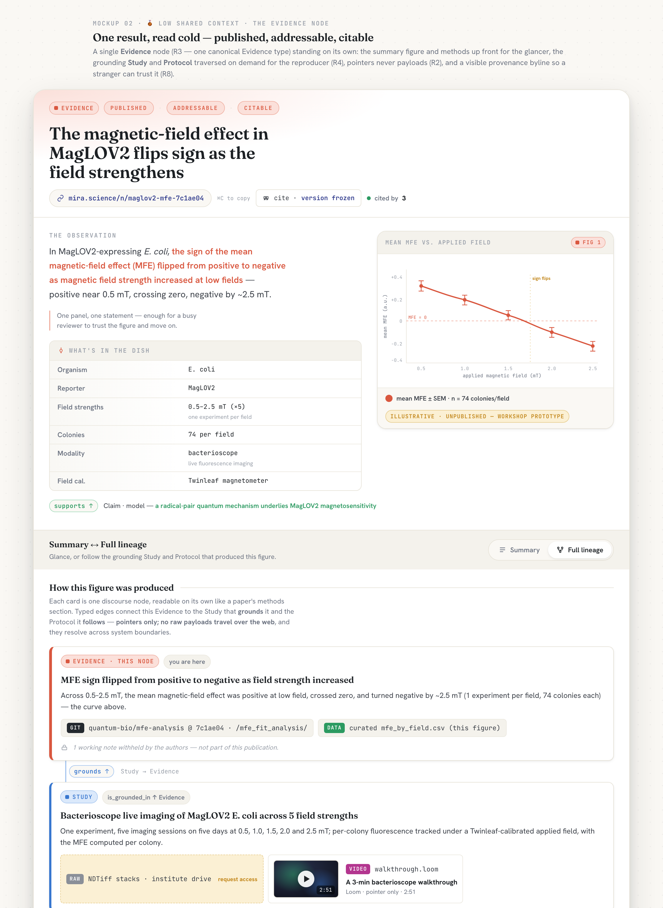

### 03 · Public web view · no DG app — [`mockups/03-public-web-view.html`](./mockups/03-public-web-view.html) · [**open live ↗**](https://mira-science.github.io/inter-lab-user-story/03-public-web-view.html)
*The in-repo reference screen. The published result as a public web page at a URL — summary-first,
traversable subgraph, pointer chips, a provenance byline, a **frozen** citation, and a **request-access**
path to the gated raw data (R4, R5, R6, R7, R8, R9).*
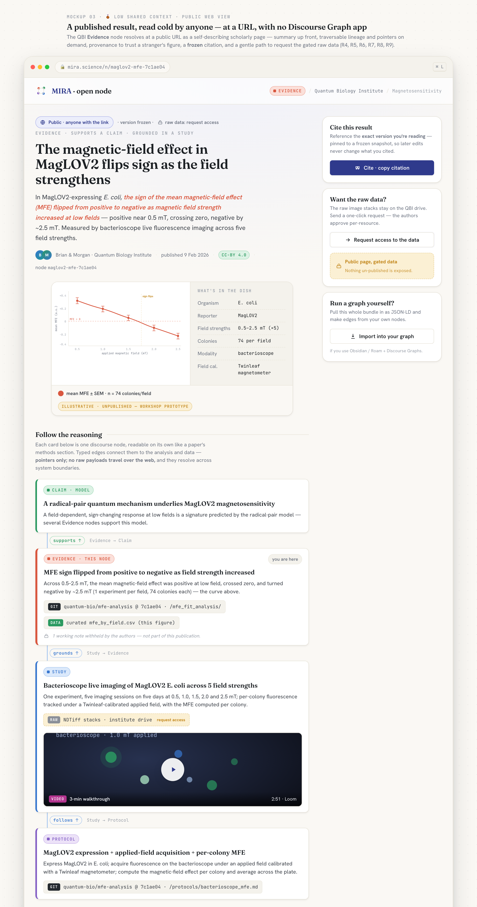

### 04 · Micropublication · specs instead of papers — [`mockups/04-micropublication.html`](./mockups/04-micropublication.html) · [**open live ↗**](https://mira-science.github.io/inter-lab-user-story/04-micropublication.html)
*Several independently-addressable `Evidence` bundles compile into one Jupyter Book micropublication; a
`Claim`/model emerges; the narrative is **AI-drafted, human-edited**; each subfigure links back to its
live bundle (R7, R11).*
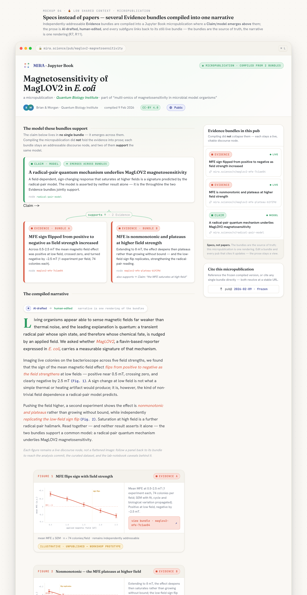

### 05 · Public database & cite — [`mockups/05-public-database.html`](./mockups/05-public-database.html) · [**open live ↗**](https://mira-science.github.io/inter-lab-user-story/05-public-database.html)
*The published graph as a public dashboard — every node a URL with provenance and a **"cited by N"**
signal — plus citing a specific result with a **frozen version pin** (R1, R6, R8, R9).*
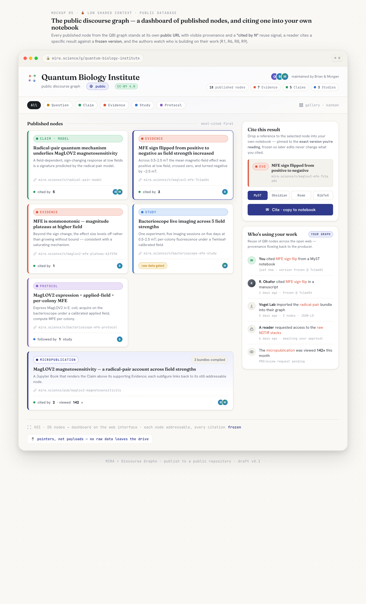

---

## The design system

The mockups carry the "DG × MIRA" design language (`tokens.css` + `components.css`), plus two small
extension blocks at the bottom of `components.css`:

- **`mockups/tokens.css`** — the canonical Discourse-Graph node palette (Question · gold, Claim · green,
  Evidence · coral, Study · blue, Protocol · violet, Request · indigo, Source · teal), a warm
  "lab-notebook" light theme + a dark `.theme-obsidian` mode, and the type stack: **Fraunces** (display),
  **Hanken Grotesk** (UI), **JetBrains Mono** (pointers / JSON-LD / URLs / DOIs / version hashes).
- **`mockups/components.css`** — reusable node cards, type badges, pointer chips, typed edges,
  share-level chips, toasts, avatars, the step rail — **plus** two story extensions: the QSI block
  (`.avatar.brian`/`.morgan`/`.qbi`/`.world`, `.share-level.world`/`.gated`, `.cite`, `.reuse`) and the
  **dashboard block** (`.avatar.sean`/`.kate`/`.grad`, `.share-level.consortium`, `.node.candidate`,
  `.request`, `.viewswitch`, `.preset`, `.dash-search`).

Built per Claude's **frontend-design** sensibility (distinctive, production-grade, motion on load).

### Viewing the mockups
**Online (no download):** the **[live gallery ↗](https://mira-science.github.io/inter-lab-user-story/)** on GitHub Pages.

**Locally:**
```bash
open artifacts/mockups/index.html          # macOS — then click through the gallery
# or just double-click any mockups/*.html file
```
Each screen is a single self-contained HTML file (relative CSS hrefs, no build step). To re-render the
PNG previews (Chrome headless, with a virtual-time budget so the load animations settle):
```bash
"/Applications/Google Chrome.app/Contents/MacOS/Google Chrome" --headless=new --hide-scrollbars \
  --force-device-scale-factor=2 --virtual-time-budget=2600 --window-size=1200,2300 \
  --screenshot=artifacts/mockups/previews/07-shared-dashboard.png \
  "file://$PWD/artifacts/mockups/07-shared-dashboard.html"
```

---

*MIRA × Discourse Graphs · push results to a shared web interface · dashboard (central) + QSI (public) · v0.4 · UX spec consolidated 2026-06-15 — see [`ux-spec.md`](./ux-spec.md)*
