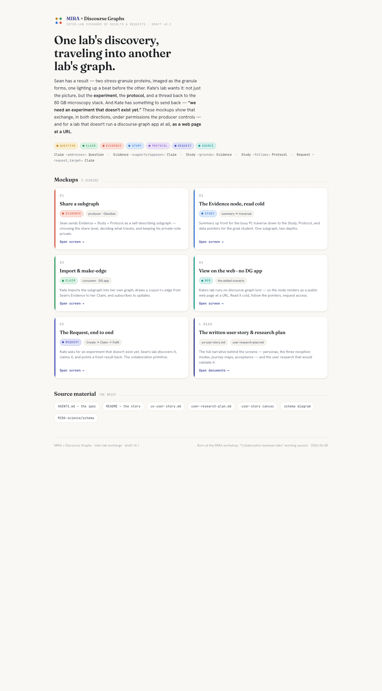
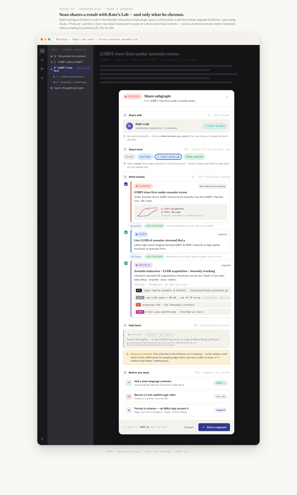
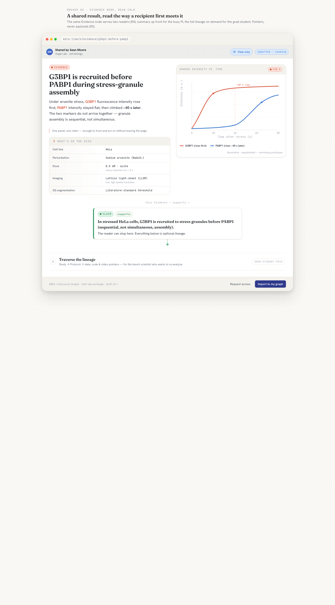
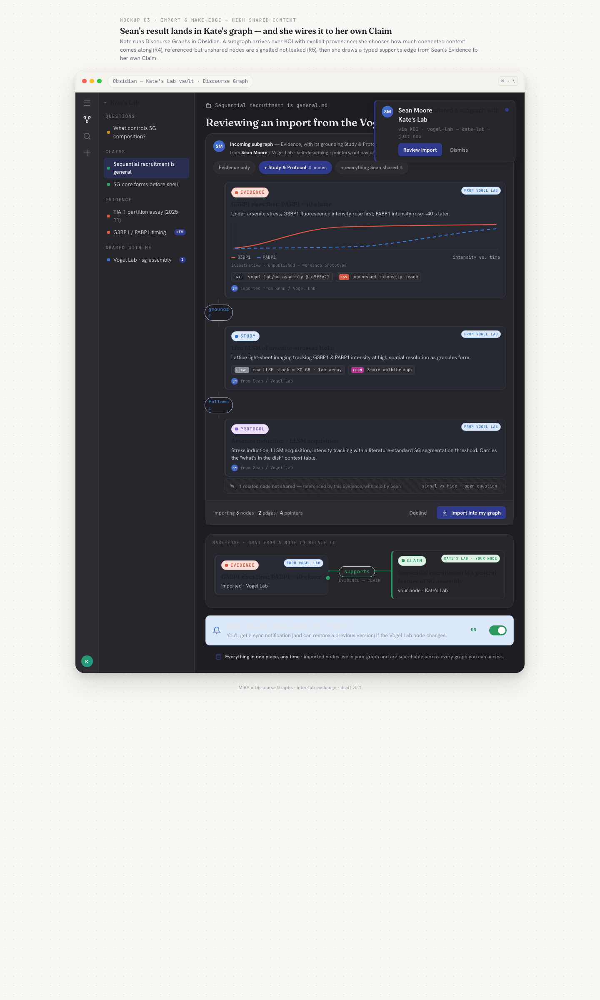
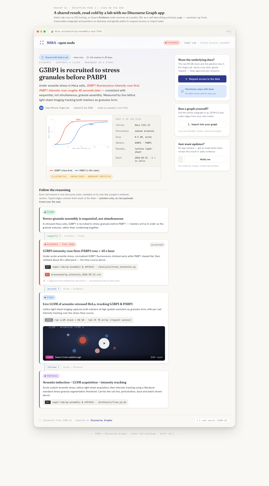
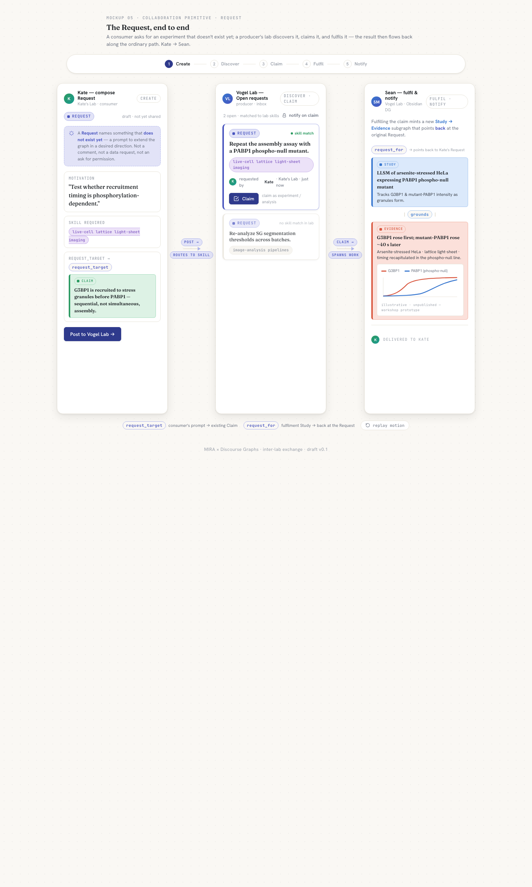

# Artifacts — UX user story, mockups & user research

*Fleshing out the [inter-lab exchange user story](../README.md): how one lab's result travels into
another lab's graph, and how a request travels back. Built from [`../AGENTS.md`](../AGENTS.md) (the
spec), the workshop transcript, the [MIRA schema](https://github.com/MIRA-science/schema), and the
Discourse Graphs team's inter-graph use-case work.*

> **Start here:** open [`mockups/index.html`](./mockups/index.html) in a browser for the gallery,
> then read [`ux-user-story.md`](./ux-user-story.md). Previews are inlined below so the work is
> viewable on GitHub without opening anything.

---

## What's in here

| Artifact | What it is |
|---|---|
| **[`ux-user-story.md`](./ux-user-story.md)** | The flagship narrative — personas, the two-directional spine, the **three reception modes**, two journey maps, the mockup-map, acceptance criteria, and the open questions carried into design. |
| **[`user-research-plan.md`](./user-research-plan.md)** | What we already know (settled by spec/transcript) vs. what to ask users — themed open questions with methods, a recruiting plan, per-mockup usability tasks, signals & metrics, and ethics. |
| **[`mockups/`](./mockups/)** | Five interactive HTML screens + a gallery `index.html`, sharing one design system (`tokens.css` + `components.css`). Open any `.html` in a browser. |
| **[`mockups/previews/`](./mockups/previews/)** | PNG renders of every screen (shown below) for quick/GitHub viewing. |
| `_grounding.md` · `_design-brief.md` | The internal source-of-truth pack and visual brief the artifacts were built against (kept for provenance; cited by the docs). |

---

## The three reception modes (the spine of the story)

When Sean shares, *who is on the other end, and what do they have to receive it with?* The story
collapses the Roam "levels of shared context" into three concrete UX modes:

1. **Import into a DG app** — Kate's lab runs Obsidian/Roam DG; the subgraph travels over KOI-net as
   JSON-LD and becomes live nodes she can make-edge against. → mockups **01, 02, 03**
2. **View on the web — no DG app** *(the explicitly added scenario)* — Kate's lab runs no DG tooling,
   so the node renders as a **web page at a URL** (DG's *"share discourse nodes on the web"*; *"markdown
   rendered as HTML is ok for v0"*). Read it cold, follow the pointers, request access. → mockups **02, 04**
3. **Request back** — Kate fires a `Request` (an experiment that doesn't exist yet); Sean's lab
   discovers, claims, and fulfils it, and the result flows home. → mockup **05**

---

## Mockups

The worked example throughout is Sean's real stress-granule result (illustrative protein names):
*under arsenite stress, **G3BP1** fluorescence rises first; **PABP1** rises ~40 s later* — grounded in
a live lattice-light-sheet `Study` following an arsenite-stress + LLSM `Protocol`, carrying **pointers**
(git / S3·local / video), never the 80 GB raw stack.

### Gallery — [`mockups/index.html`](./mockups/index.html)


### 01 · Share a subgraph — [`mockups/01-share-subgraph.html`](./mockups/01-share-subgraph.html)
*Producer side, in Obsidian. Sean picks the share level, sees exactly what travels (Evidence + Study +
Protocol + pointers), and holds back his private "is the lag an artifact?" note **without leaking its
existence** (R1, R2, R4, R5).*


### 02 · The Evidence node, read cold — [`mockups/02-evidence-node.html`](./mockups/02-evidence-node.html)
*Summary up front for the PI — figure + "what's in the dish" methods table — then **traverse the
lineage** down to Study, Protocol, and the data pointers for the grad student. One subgraph, two
depths (R4, R2, R3).*


### 03 · Import & make-edge — [`mockups/03-kate-import.html`](./mockups/03-kate-import.html)
*Consumer side, in a DG app. Kate imports the subgraph with provenance, draws a `supports` edge from
her own Claim to Sean's imported Evidence, and subscribes to updates (AGENTS.md §9; R1).*


### 04 · View on the web · no DG app — [`mockups/04-web-view.html`](./mockups/04-web-view.html)
*The added scenario. The shared node as a public web page at a URL for a lab with no DG tooling —
summary-first, traversable subgraph, pointer chips, walkthrough video, and request-access / import-later
CTAs. The web view is a front door, not a dead end.*


### 05 · The Request, end to end — [`mockups/05-request-flow.html`](./mockups/05-request-flow.html)
*The collaboration primitive. Kate composes a Request (motivation, skill required, `request_target` →
Claim); Sean's lab discovers and claims it; fulfilment generates a new Study → Evidence that points
back; Kate is notified (AGENTS.md §6).*


---

## The design system

The mockups share one "DG × MIRA" design language so the five screens read as one product:

- **`mockups/tokens.css`** — the canonical Discourse-Graph node palette (Question · gold, Claim ·
  green, Evidence · coral, Study · blue, Protocol · violet, Request · indigo, Source · teal), a warm
  "lab-notebook" light theme + a dark `.theme-obsidian` mode, and the type stack: **Fraunces**
  (display), **Hanken Grotesk** (UI), **JetBrains Mono** (pointers / JSON-LD / RIDs).
- **`mockups/components.css`** — reusable node cards, type badges, pointer chips, typed edges,
  permission/share-level chips, toasts, avatars, and the step rail.

Built per Claude's **frontend-design** skill (distinctive, production-grade, motion on load).

### Viewing the mockups
```bash
open artifacts/mockups/index.html          # macOS — then click through the gallery
# or just double-click any mockups/*.html file
```
Each screen is a single self-contained HTML file (relative CSS hrefs, no build step). To re-render the
PNG previews: `chrome --headless=new --screenshot=out.png --window-size=1440,2400 file://…/04-web-view.html`.

---

*MIRA × Discourse Graphs · inter-lab exchange · draft v0.1 · born at the MIRA workshop, 2026-06-08*
